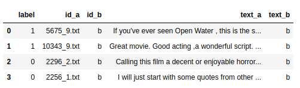
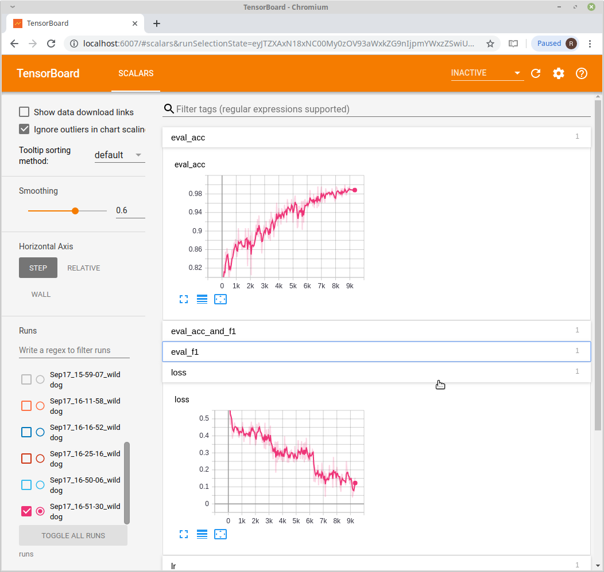

# Classification with Transformers
Modified the code from [here](https://github.com/huggingface/pytorch-transformers/blob/master/examples/run_glue.py) with the goal of making it more modular and easier to understand.

## Requirements
Create conda env:

conda env create -f requirements.yml

## Settings
Edit config.py. Need to particularly fill the upper (required) group of inputs (e.g., data directory).

## Data
Make with your data a tsv file (i.e., tab-separated values) that looks like the following:

An easy way to do so is to make a Pandas dataframe as above and then save like so

train_df.to_csv("/path/to/data/dir/train.tsv", sep="\t", index=False)

dev_df.to_csv("/path/to/data/dir/dev.tsv", sep="\t", index=False)

notes:
- Make sure that (in config.py): data_dir = /path/to/data/dir/
- id_b and text_b are not used for classification, but just enter something (leaving them empty gave me an error I believe).
- Yes, instead of "val" it is called "dev", and it is tab-separated instead of comma-separated. 
- All this could be changed, but just wanted to use the code that was already there.

## Run
On terminal type:

python -m transformers_clf.finetune_pretrained

This is because tranformers_clf is a package.

To monitor run tensorboard as usual: tensorboard --logdir runs

## Example on IMDB
99% validation accuracy...

